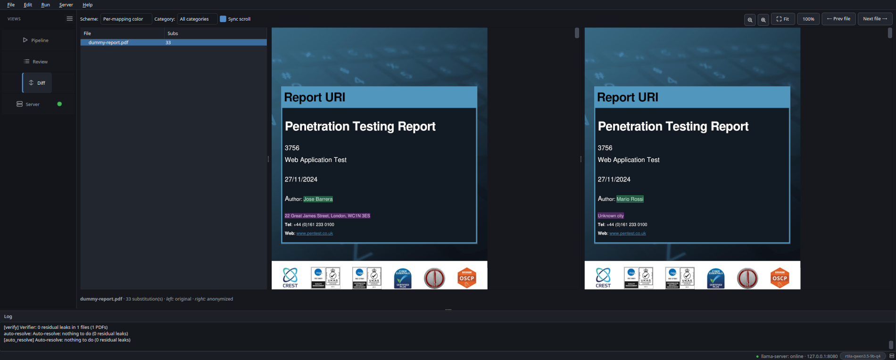
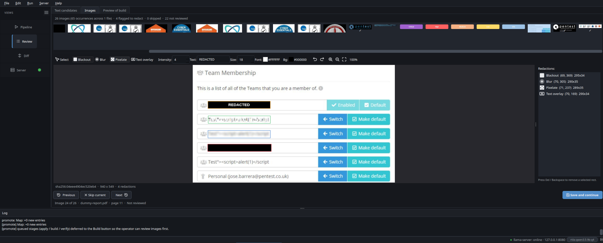
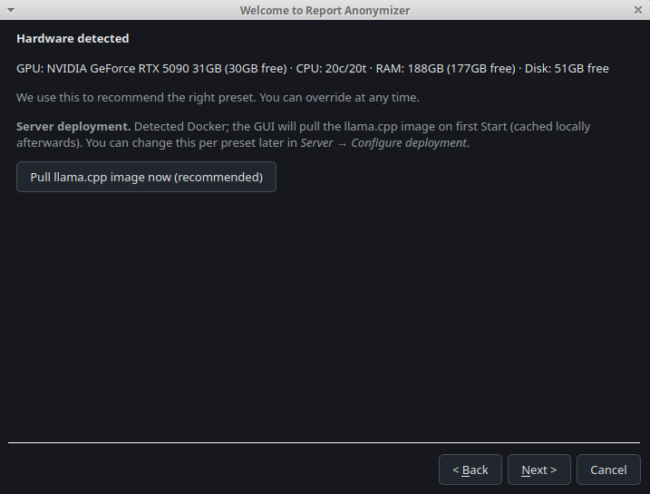
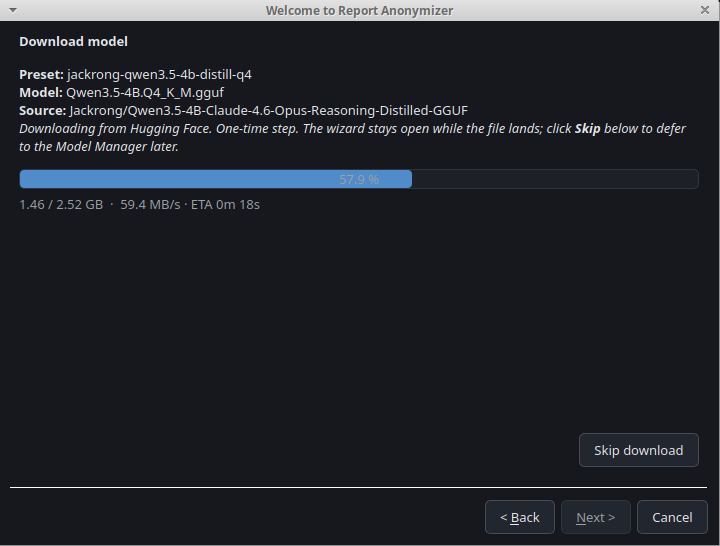
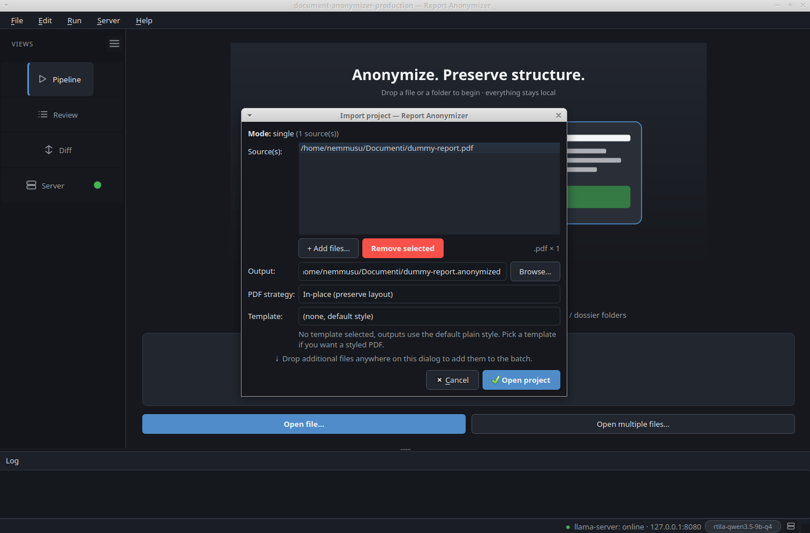
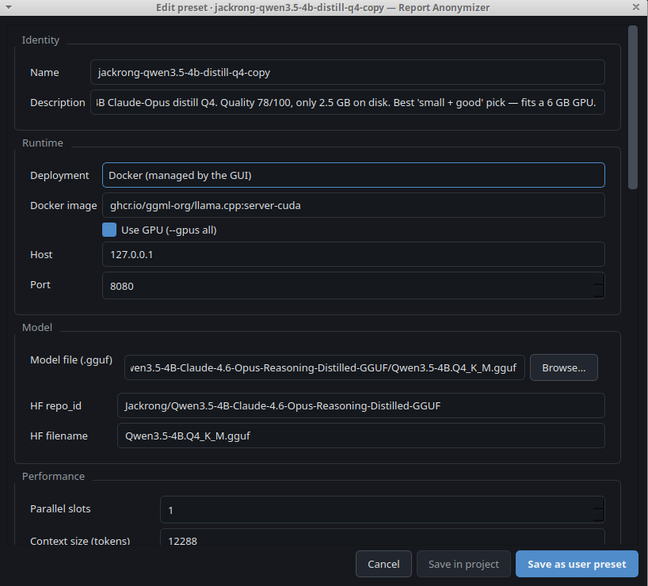
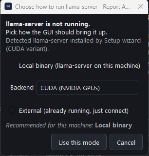
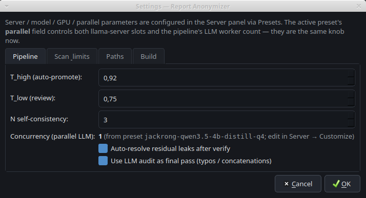
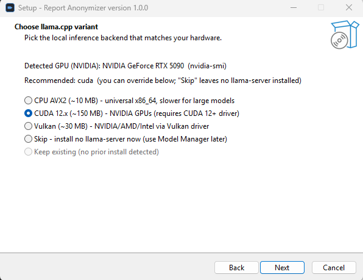
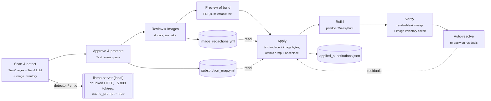

<div align="center">

# 🛡️ Report Anonymizer

**Local LLM anonymizer for penetration-test reports.** Drop in PDFs,
Office docs, Markdown or code. The pipeline rewrites customer brand,
real IPs, phone numbers, hardcoded credentials, advisory IDs,
proprietary HTTP headers, app package and bundle identifiers, AD
SIDs and cloud resource IDs. Exploit code, payloads and shell output
stay untouched. Runs locally on a regular laptop.

[](https://github.com/nemmusu/report-anonymizer/actions/workflows/ci.yml)
[](https://github.com/nemmusu/report-anonymizer/releases/latest)
[](https://nemmusu.github.io/report-anonymizer/)
[](https://nemmusu.github.io/report-anonymizer/install-windows/)
[](https://github.com/nemmusu/report-anonymizer/releases/latest)
[](#option-e-from-source-developers)
[](pyproject.toml)
[](https://doc.qt.io/qtforpython/)
[](https://github.com/ggerganov/llama.cpp)
[](tests/)
[](LICENSE)
[](#-privacy)
[](https://github.com/nemmusu/report-anonymizer/stargazers)

[Features](#-features) ·
[What it anonymizes](#-what-it-anonymizes) ·
[Quick start](#-quick-start) ·
[Benchmarks](BENCHMARKS.md) ·
[Docs site](https://nemmusu.github.io/report-anonymizer/) ·
[Roadmap](#-roadmap)

</div>

---

> **Drop a folder, get a redacted twin.** A pentest report needs
> to keep its attack chains, exploits and shell output readable.
> Only the values that identify the customer should be masked.
>
> The pipeline scans every file in the folder. A deterministic regex
> layer plus a local LLM detector and a critic propose plausible,
> neutral substitutes for every leak. Names are not blacked out and
> not replaced with `XXX`: they are rewritten in place with realistic
> dummy values so the redacted document still reads naturally.
> `AcmeBank` becomes `VendorBank`, `+39 344 1234567` becomes
> `+39 344 0000001`, `arn:aws:iam::123456789012:role/Admin` becomes
> `arn:aws:iam::000000000001:role/vendor-1`.
>
> You stay in control. The Review pane shows every candidate next
> to a live preview of the anonymized output. You can approve, skip
> or edit each suggestion (typing your own replacement is editing,
> never blackout), and you can add custom words by typing them in
> with the dummy you want them mapped to. When you are happy, click
> Apply and the redacted folder is written. Re-run on new versions
> of the same report any time: the substitutions stay stable across
> runs. The pipeline talks to a local llama.cpp server, so nothing
> leaves your machine.
>
> **No GPU? No problem.** The shipped `default` preset runs entirely
> on CPU with a 4 B-parameter Q4_K_M model (Quality 78, ~2.5 GB on
> disk, fits within 8 GB of free RAM). A regular laptop redacts a
> real pentest report end-to-end — expect roughly 10× the wall time
> of the equivalent GPU run (see [BENCHMARKS.md](BENCHMARKS.md)).
> The first-run wizard auto-upgrades the preset at ≥10 GB VRAM
> (`ministral-3-8b-reasoning-q5`, Quality 76) and at ≥19 GB VRAM
> (`ministral-3-8b-reasoning-bf16`, Quality 83 — top of the curated
> set).

<div align="center">
  
  <br/>
  <em>Side-by-side native render. Every customer-identifying value is rewritten with a plausible dummy, while layout and fonts are preserved.</em>
</div>

---

## ✨ Features

| Feature | What it does |
|---|---|
| 🧠 **Multi-tier LLM detection** | Tier-0 deterministic regex, Tier-1 LLM detector, critic, self-consistency voting. Most leaks auto-promote, only the ambiguous ones reach Review. |
| 🎚️ **Detection mode picker** | Pipeline tab toggle right next to **Run**: **Fast** (one monolithic prompt covering all 12 categories per chunk, ~30 s / typical PDF on the 4B preset) vs **High accuracy** (11 focused per-category prompts run against every chunk and merged; ~5× more detector time, +0.08 F1 / +0.12 precision on the local 5-PDF bench). Same toggle from the CLI via `--detector-mode single \| multipass`. |
| 🖼️ **Image redaction** | New: every embedded image in PDF / DOCX / PPTX gets a thumbnail in the Review tab. Open the editor, paint **blackout / blur / pixelate / text-overlay** rects with a colour picker for the text overlay. Live bake renders the actual pixels (not a translucent overlay) as you draw. Same image_id across pages = one decision, applied everywhere; output keeps the same xref / shape position so layout is byte-faithful. |
| 🔍 **Real after-state preview** | Three review tabs: **Text candidates** (with live preview), **Images** (gallery + editor), **Preview of build** (PDF.js viewer with native text selection, Ctrl+C, search). Highlights are baked as PDF annotations so selection still works on top of them. |
| 📑 **Right-click "Add to substitution map"** | Drag-select text in the PDF viewer (or just right-click on a word), one click adds it to the map with a configurable placeholder. Toast confirms; preview re-renders with the new mapping highlighted in seconds. |
| 🧾 **Format-aware adapters** | Native handlers for `.pdf` (in-place redaction or re-derive), `.docx`, `.doc`, `.pptx`, `.odt`, `.rtf`, `.xlsx`, `.html`, `.md` and 60+ text and code extensions. PDFs preserve layout, fonts and byte length. PDF / DOCX / PPTX also support image redaction in place (same xref / shape position). |
| 🪄 **One-shot Run** | A single click orchestrates the whole pipeline (scan, detect, critic, triage). It pauses at Review by default, so the operator always sees every candidate before Apply. After Apply, residual leaks are auto-resolved. |
| 📝 **Inline review** | Edit, approve, skip or un-approve placeholders in a single tree (already-mapped, auto-promoted, pending). Or type custom words to anonymize. Every change persists immediately to disk. |
| 🔁 **Crash-safe and resumable** | Atomic writes (`*.tmp` plus `os.replace`), per-stage checkpoints, full `run_manifest.json`. Reopen the project to resume. |
| ⚙️ **Server presets + auto-start** | Six curated llama.cpp profiles (BF16, Q4_K_M, Q5_K_M, 12K to 16K context) with VRAM and runtime measured on a real corpus. Hot-edit from the GUI, save to user or project scope. Sidebar shows a green/amber/red dot for connect state; one click triggers a pre-flight check + start with a specific error dialog when something is wrong. Optional **auto-start on launch** toggle. |
| 🤗 **Hugging Face integration** | Curated GGUF catalog, free-text search, resumable streaming downloads with progress and ETA, gated-repo flow. |
| 🛑 **Stop anywhere** | Every long stage cancels cooperatively from the global Stop button. |
| 🔒 **Privacy by design** | No telemetry. The only network endpoint ever contacted is `huggingface.co`, and only when you explicitly download a model. |

---

## 🎯 What it anonymizes

The detector emits one of 12 categories per leak. Every leak is
replaced with a plausible dummy value, never blacked out, never
substituted with `XXX`, `[REDACTED]` or asterisks. Placeholders are
also length- and shape-preserving, so PDF redaction does not need to
reflow. The full taxonomy with examples and counter-examples lives
in [docs/anonymization-scope.md](docs/anonymization-scope.md).

| Category | What goes in | Example placeholder |
|---|---|---|
| `brand` | customer and product names, suite, vendor | `VendorApp`, `VendorVoice` |
| `network` | real public IPs, customer hostnames and domains | `203.0.113.NN`, `vendor.example` |
| `phones` | E.164 numbers, any country | `+1 (415) 555-0001` |
| `emails` | addresses on the customer domain or for real involved people | `user01@vendor.example` |
| `credentials` | plaintext usernames and passwords, `Authorization: Basic …`, session cookies, NTLM hash dumps | `u.demo` / `Aaaaaaa00!` |
| `keys` | hardcoded tokens, hex hashes, JWTs, SAML or OAuth bearers, Apple Team IDs, APNs device tokens | length-preserving hex with the first 8 chars kept |
| `headers` | proprietary HTTP headers (`X-AcmeBank-Auth`, `X-ContosoServer-Token`) | `X-Vendor-Auth` |
| `app_packages` | reverse-domain Android packages and iOS bundle IDs that encode the customer (`com.acme.app`, `it.acmebank.mobile`) | `com.vendor.app` |
| `user_agents` | client UA strings tied to the customer's app, including iOS CFNetwork shapes | `VendorApp/1.0-android`, `VendorApp/1.0 CFNetwork/0000.0 Darwin/0.0.0` |
| `ids` | internal tracking and advisory IDs whose prefix encodes the brand (`ACME-VULN-12`) | `VENDOR-VULN-12` |
| `infra_ids` | cloud, Active Directory and infrastructure resource identifiers (AWS ARNs and account IDs, EC2 / EBS / S3 IDs, Azure UUIDs, GCP project IDs, AD SIDs and ObjectGUIDs, branded `DC=…` distinguished-name pieces) | `arn:aws:iam::000000000001:role/vendor-1`, `i-0a1b2c3d000000001`, `S-1-5-21-0000000001` |
| `other` | proprietary URI schemes and deeplinks (`acme-app://…`) and other vendor-tied tokens | `vapp://x.vendor.example/foo` |

The pipeline never touches the report's technical content: exploit
code, payloads, shell output, RFC ranges, well-known libraries
(NaCl, OAuth, JWT and so on), generic OS or SDK versions, dates,
generic file names, code identifiers and variable names. The
[deep dive](docs/anonymization-scope.md) lists the full negative set.

---

## 🎬 Demo

<table>
<tr>
<td width="50%">
<div align="center">
  
  <br/><sub><b>Pipeline.</b> Visual stepper, live progress, log streaming for every stage. The run pauses at <em>Approve and promote</em>, then resumes through Apply, Build, Verify and Auto-resolve in one click.</sub>
</div>
</td>
<td width="50%">
<div align="center">
  
  <br/><sub><b>Review.</b> Already-mapped, auto and pending rows in a single tree. The right pane is a live render of the anonymized output, so you see exactly what Apply will write.</sub>
</div>
</td>
</tr>
<tr>
<td width="50%">
<div align="center">
  
  <br/><sub><b>Server.</b> Preset gallery with quality score, disk and VRAM fit per card, command preview, one-click start and stop, in-app Model Manager.</sub>
</div>
</td>
<td width="50%">
<div align="center">
  
  <br/><sub><b>Model Manager.</b> Curated GGUF catalog with quality, VRAM and time-on-bench badges, recommended-file highlight, resumable streaming downloads with a Queue tab.</sub>
</div>
</td>
</tr>
<tr>
<td width="50%">
<div align="center">
  
  <br/><sub><b>Review &raquo; Images.</b> Per-image editor for embedded screenshots: blackout, blur, pixelate, text overlay with colour picker. Live bake renders the actual pixels as you draw. Same image_id across pages = single decision applied everywhere.</sub>
</div>
</td>
<td width="50%">
<div align="center">
  
  <br/><sub><b>Preview of build.</b> PDF.js viewer with native drag-select text + Ctrl+C. Right-click on the highlight to <em>add to substitution map</em> in one click. Final confirmation gate before Apply runs.</sub>
</div>
</td>
</tr>
</table>

<details>
<summary><b>More screenshots</b>: wizard, import, preset editor, settings</summary>

<br/>

<table>
<tr>
<td width="50%">
<div align="center">
  
  <br/><sub><b>First-run wizard.</b> Hardware detection plus preset recommendation, with an optional one-click llama.cpp image pull.</sub>
</div>
</td>
<td width="50%">
<div align="center">
  
  <br/><sub><b>Model download.</b> Resumable streaming with live speed and ETA. Skippable for offline-first installs.</sub>
</div>
</td>
</tr>
<tr>
<td width="50%">
<div align="center">
  
  <br/><sub><b>Import.</b> Drag and drop or pick files, choose PDF strategy and export template up front.</sub>
</div>
</td>
<td width="50%">
<div align="center">
  
  <br/><sub><b>Preset editor.</b> Every llama-server knob is exposed, with Save in project or Save as user-scope.</sub>
</div>
</td>
</tr>
<tr>
<td width="50%">
<div align="center">
  
  <br/><sub><b>Deployment chooser.</b> Local binary, GUI-managed Docker, or attach to a server you already run.</sub>
</div>
</td>
<td width="50%">
<div align="center">
  
  <br/><sub><b>Settings.</b> Pipeline thresholds, self-consistency, residual auto-resolve, optional final LLM audit pass.</sub>
</div>
</td>
</tr>
</table>

</details>

---

## 🚀 Quick start

There are five install paths, in order of friction. Windows users
should start with **Option A**; Linux users typically pick **Option B**
(AppImage) or **Option C** (`.deb`).

### Option A. Windows installer (one click, recommended for Windows)

Native Windows installer for Windows 10 / 11. Bundles the embedded
Python runtime, `llama-server.exe` (CPU / CUDA / Vulkan variants),
`pandoc` and `pdftotext`. Pick the GPU backend at install time, no
admin rights required.

<div align="center">
  
</div>

Grab the EXE from the [latest GitHub release](https://github.com/nemmusu/report-anonymizer/releases/latest)
(`Report-Anonymizer-Setup-x64-1.0.0.exe`, ~338 MB) and double-click.
SmartScreen may flag the unsigned installer; click *More info → Run
anyway*. Full walkthrough: [docs/install-windows.md](docs/install-windows.md).

### Option B. AppImage (one click, recommended for Linux desktops)

```bash
# Download once, run forever. No system Python, pip, venv or build tools required.
chmod +x Report-Anonymizer-x86_64.AppImage
./Report-Anonymizer-x86_64.AppImage
```

The AppImage bundles a portable Python interpreter, every Python
dependency (PySide6, WeasyPrint and so on), `pandoc` and
`pdftotext`. The only system libraries it needs are Pango and
Cairo, which ship with every modern desktop Linux. The latest build
is attached to the [GitHub release](https://github.com/nemmusu/report-anonymizer/releases/latest).

### Option C. `.deb` (Debian, Ubuntu, Mint)

```bash
# Download from the latest GitHub release, then install via apt.
sudo apt install ./report-anonymizer_<version>_amd64.deb
report-anonymizer
```

The package installs to `/opt/report-anonymizer/` with a launcher at
`/usr/bin/report-anonymizer`. It declares clean `Depends:` on
system `pandoc`, `poppler-utils`, `libpango-1.0-0`, `libcairo2` and
`python3-venv`. The `postinst` hook builds a per-install Python
venv and pip-installs the runtime dependencies from PyPI (the
package itself is around 230 KB on disk). Uninstall with
`sudo apt remove report-anonymizer`.

### Option D. One-line installer (any Linux distro)

```bash
curl -fsSL https://raw.githubusercontent.com/nemmusu/report-anonymizer/master/install.sh | bash
```

Sets up a per-user install under `~/.local/share/report-anonymizer`
with a launcher in `~/.local/bin/report-anonymizer`. The script
detects missing system tools (pandoc, poppler-utils, Pango) and
offers to install them via `apt-get`, `dnf`, `pacman`, `zypper` or
`brew`. Uninstall with `report-anonymizer uninstall [--all]`.

### Option E. From source (developers)

```bash
git clone https://github.com/nemmusu/report-anonymizer
cd report-anonymizer
python3.12 -m venv .venv && . .venv/bin/activate
pip install -r requirements.txt
# Build llama.cpp (or point a preset at your existing build)
# https://github.com/ggerganov/llama.cpp#build
python -m gui.main
```

On first launch the wizard walks you through hardware detection and
preset choice. The recommended preset is highlighted automatically
based on detected GPU memory: 19 GB or more selects
`ministral-3-8b-reasoning-bf16`, 10 GB or more selects
`ministral-3-8b-reasoning-q5`, otherwise the shipped `default`
profile is used (Jackrong Qwen3.5 4B Claude-Opus distill Q4_K_M, no
GPU required, around 2.5 GB to download, Quality 78/100).

### Building the .deb or AppImage yourself

```bash
./packaging/build-all.sh                     # both
./packaging/build-all.sh --only deb          # just the .deb
./packaging/build-all.sh --only appimage     # just the AppImage
./packaging/build-all.sh --version 0.2.8     # bump deb version
./packaging/build-all.sh --clean             # wipe build caches first
```

Outputs land in `packaging/deb/dist/` and
`packaging/appimage/dist/`. The inner build scripts
([packaging/deb/build.sh](packaging/deb/build.sh),
[packaging/appimage/build.sh](packaging/appimage/build.sh)) can be
run individually too.

### CLI

```bash
# Full pipeline on one folder
python bin/anonymize-dossier all <input_folder> -o <output_folder>

# Individual stages
python bin/anonymize-dossier scan         <input>
python bin/anonymize-dossier promote      <input>
python bin/anonymize-dossier apply        <input> -o <output>
python bin/anonymize-dossier build        <output>
python bin/anonymize-dossier verify       <output>

# One-off helpers
python bin/anonymize-dossier selftest                       # probe pandoc, WeasyPrint, etc.
python bin/anonymize-dossier migrate-map <output>           # upgrade legacy substitution_map.yml
python bin/anonymize-dossier export-pdf  <output> -t pentest_modern

# Server lifecycle
python bin/anonymize-dossier server   {start,stop,status}
```

---

## 🧪 Benchmarks

5-PDF pentest corpus, 44 manually curated ground-truth values. Quality
is `F1 × 100`. The full leaderboard (93 models) lives in
[BENCHMARKS.md](BENCHMARKS.md).

### Curated presets (top 5)

| # | Profile | **Quality** | Precision | Recall | Disk | VRAM | Total |
|---|---|---|---|---|---|---|---|
| 🥇 | `ministral-3-8b-reasoning-bf16` | **83** | 75.5 % | **90.9 %** | 16.0 GB | ~18.9 GB | 244 s |
| 🥈 | `rtila-qwen3.5-9b-q4` | 82 | 74.1 % | **90.9 %** | 5.2 GB | **~7.1 GB** | **79 s** |
| 🥉 ★ | `jackrong-qwen3.5-4b-distill-q4` | 78 | **79.1 %** | 77.3 % | **2.5 GB** | **~4.8 GB** | 185 s |
| 4 | `qwen3.5-9b-bf16` | 78 | **80.5 %** | 75.0 % | 18.4 GB | ~18.0 GB | 210 s |
| 5 | `ministral-3-8b-reasoning-q5` | 76 | 65.6 % | **90.9 %** | 5.8 GB | ~9.2 GB | 112 s |

**`jackrong-qwen3.5-4b-distill-q4`** is the **recommended starting
point**: smallest disk footprint (2.5 GB), fits a 6 GB GPU, and
its precision (79.1 %) is the second-highest of the curated set
(only `qwen3.5-9b-bf16` at 80.5 % is higher, at almost 4x the VRAM
cost). The shipped `default` preset uses the same weights
configured for CPU only (`n_gpu_layers: 0`), so the same model
covers both "I have a modest GPU" and "I have no GPU at all" cases.

### How to pick

| Hardware or goal | Pick |
|---|---|
| 18+ GB VRAM, max quality | `ministral-3-8b-reasoning-bf16` |
| 18+ GB VRAM, fewest false alarms | `qwen3.5-9b-bf16` |
| ~7 GB VRAM, near-leader quality | `rtila-qwen3.5-9b-q4` |
| ~6 GB VRAM, smallest "good" model | `jackrong-qwen3.5-4b-distill-q4` ★ recommended |
| ~10 GB VRAM, reasoning quality | `ministral-3-8b-reasoning-q5` |
| No GPU | `default` (Jackrong 4B distill Q4_K_M on CPU) |

The other 27 benchmarked models live below the curated cut in
[BENCHMARKS.md](BENCHMARKS.md). All are reachable from the Model
Manager free-text search with their badges (low quality, incompatible).

---

## 🏗️ Architecture



- The **detector** chunks each segment via a Markdown-aware splitter
  that never breaks tables, code fences or headings.
- The **critic** double-checks every candidate with an independent
  LLM pass. Rejects with `placeholder_safe: no` go to Review.
- The **applier** writes each output atomically via `*.tmp` plus
  `os.replace`.
- The **verifier** sweeps the output for residual leaks (NFKC
  normalise, entity-decode, zero-width strip).

The full data flow and on-disk schema are in
[docs/architecture.md](docs/architecture.md).

---

## 📦 Repository layout

```
anonymize/                       engine package
  format_adapters/               docx / xlsx / pptx / odt / rtf / pdf / text
  pipeline.py                    high-level stage orchestration
  scanner.py                     file inventory (symlink-safe, gitignore-aware)
  detector.py / critic.py        LLM detection and critic (parallel)
  structure_chunker.py           Markdown-aware splitter
  applier.py                     deterministic substitution + atomic writes
  builder.py                     pandoc + WeasyPrint renderer
  verifier.py                    post-build residual-leak sweep
  image_inventory.py             per-format embedded-image catalog (PDF/DOCX/PPTX)
  image_redactor.py              PIL pixel-ops (blackout / blur / pixelate / text overlay)
  server_profile.py              llama-server profile schema
  server_manager.py              process supervisor with diagnose()
  hf_models.py                   HF search / curated catalog / downloads
  app_settings.py                small key-value store (auto-start toggle, etc.)
  budget.py                      token-budget pre-flight check
  hardware.py                    GPU / CPU / RAM / disk + VRAM estimate
gui/                             PySide6 application
  app.py / main.py               MainWindow, splash, sidebar
  pipeline_view.py               stepper + progress card + residuals
  review_view.py                 3-tab Review (Text candidates / Images / Preview of build)
  image_review_panel.py          embedded image gallery + thumbnail strip
  image_editor.py                per-image canvas editor with live bake + colour pickers
  build_preview_panel.py         final-state preview tab with native text selection
  diff_view.py                   side-by-side rendered diff (synced scroll)
  server_panel.py                preset gallery + server controls + auto-start toggle
  preset_editor.py               preset editor with command preview
  model_manager_dialog.py        library + curated downloads + HF search
config/
  server_profiles.yml            built-in presets (6 profiles, 5 by quality + default)
  leak_patterns.yml              Tier-0 regex rules
  safe_terms.yml                 whitelist
  substitution_map.yml           example empty schema (project-scope maps live elsewhere)
prompts/                         system + user prompts (Jinja templates)
bin/anonymize-dossier            CLI entry point
tests/                           284 pytest tests, all passing
assets/                          app icon + splash + hero (SVG)
docs/
  index.md                       MkDocs landing page
  anonymization-scope.md         the 12 leak categories with examples
  architecture.md                full data flow and on-disk schema
  presets.md                     preset catalog and how to choose
  faq.md                         common questions
  contributing.md                development setup and PR guidelines
  screenshots/                   PNGs referenced from this README
BENCHMARKS.md                    leaderboard and methodology
mkdocs.yml                       MkDocs site config (used by the Pages workflow)
```

---

## 🔒 Privacy

- **No telemetry.** The app never sends usage data anywhere.
- **No cloud LLMs.** All inference runs on your local llama.cpp
  server.
- **One optional network endpoint:** `huggingface.co`, only when you
  explicitly download a model. Disable in Settings, Offline mode.
- **HF token** (if you set one) is stored at
  `~/.config/document-anonymizer/hf.token` on Linux
  (`%APPDATA%\report-anonymizer\hf.token` on Windows,
  `~/Library/Application Support/report-anonymizer/hf.token` on
  macOS), with `0600` permissions on POSIX.
- **Substitution maps stay in your project folder.** They never
  leave the machine.

---

## 🧰 Self-test

```bash
make selftest
# or
python bin/anonymize-dossier selftest
```

Probes for `pandoc`, `WeasyPrint` (Python package plus Pango and
Cairo system libs), `poppler-utils`, `tesseract`, `ocrmypdf`,
`qpdf` and a llama.cpp build. Prints install hints for what is
missing. The check is CLI-only by design (the GUI does not need a
self-test entry).

---

## 🧪 Tests

```bash
make test                                # full pytest suite (295 tests)
pytest -k chunker                        # one module
QT_QPA_PLATFORM=offscreen pytest tests/test_gui_smoke.py
```

The suite covers Tier-0 rules, Tier-1 LLM mocks, format adapters
(round-trip and identity check), pipeline stages, GUI workers and
the verifier's normalization layer.

---

## 🗺️ Roadmap

There is no fixed roadmap. The project is feature-stable for the
day-to-day "redact a folder of PDFs locally" workflow: scan, review,
apply, build, verify, plus the Model Manager and the benchmark
harness. Future changes follow real usage: bug reports, missed leaks
on real corpora, slow paths exposed by larger documents.

If you have a request, open an issue with the `enhancement` label
and describe the document or workflow you would like supported.
Concrete use cases are prioritised over speculative features.

---

## 🤝 Contributing

Pull requests are welcome. See
[docs/contributing.md](docs/contributing.md) for the development
setup, code style and what we look for in PRs.

If this project saves you a redaction pass, consider giving it a
star. It helps other security teams find the project.

---

## 📜 License

[GNU GPL v3.0](LICENSE) © Report Anonymizer contributors.

A copyleft licence: you are free to use, study, modify and
redistribute Report Anonymizer. Derivative works (forks,
re-distributions, binaries built from a modified copy) must also be
released under the GPL and ship their corresponding source code. If
you would like to integrate the engine into a product that cannot
meet that condition, please open an issue first.

<div align="center">
<sub>Built for security teams that cannot ship customer data to a cloud LLM.</sub>
</div>
