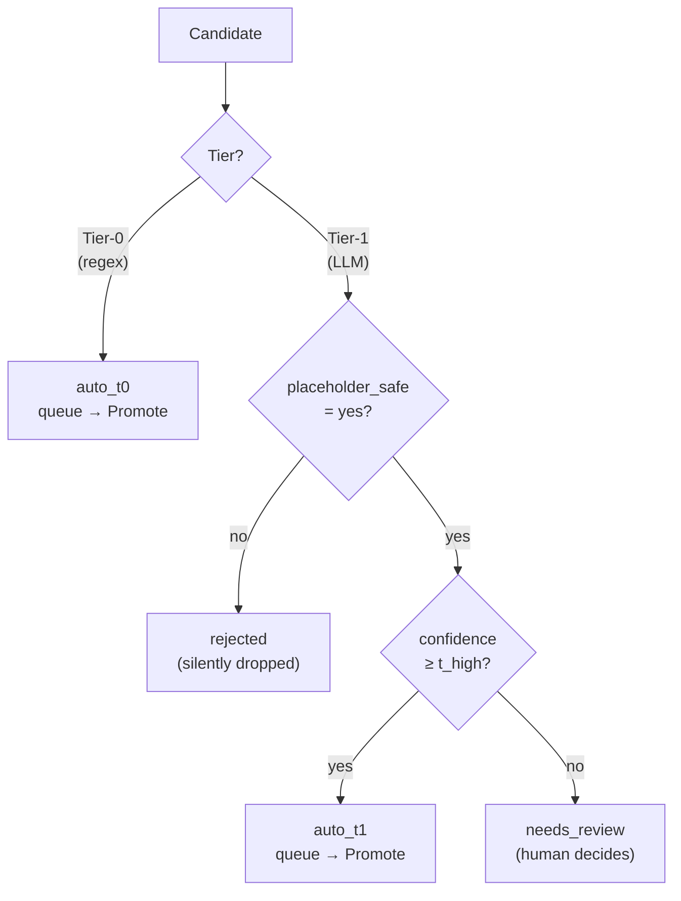

# Architecture

This page describes the data flow and on-disk schema of the
anonymizer. For a high-level overview see the [README](https://github.com/nemmusu/report-anonymizer/blob/master/README.md);
for benchmark numbers see [BENCHMARKS.md](https://github.com/nemmusu/report-anonymizer/blob/master/BENCHMARKS.md).

## Data flow

```mermaid
flowchart LR
    subgraph llama["llama-server (local, BF16 preset)"]
        srv[("chat completions API")]
    end

    scan["Scan<br/><sub>file inventory<br/>+ image inventory<br/>(PDF/DOCX/PPTX)</sub>"]
    detector["Detector<br/><sub>Tier-1 LLM<br/>structure-aware chunks</sub>"]
    critic["Critic<br/><sub>self-consistency vote<br/>placeholder_safe gate</sub>"]
    triage["Triage<br/><sub>auto_t0 / auto_t1<br/>+ pending</sub>"]
    promote["Promote<br/><sub>merge into<br/>substitution_map.yml</sub>"]
    images["Images Review<br/><sub>per-image editor<br/>writes image_redactions.yml</sub>"]
    bpreview["Build preview<br/><sub>PDF.js, native selection<br/>baked highlights</sub>"]
    apply["Apply<br/><sub>text adapters +<br/>image redactor (in-place bytes),<br/>atomic writes</sub>"]
    build["Build<br/><sub>pandoc / WeasyPrint<br/>extra exports</sub>"]
    verify["Verify<br/><sub>residual-leak sweep<br/>+ image inventory check</sub>"]
    autores["Auto-resolve<br/><sub>re-apply on affected files</sub>"]

    scan --> detector --> critic --> triage --> promote --> images --> bpreview --> apply --> build --> verify --> autores
    autores -. residuals .-> apply

    detector -- chunked HTTP<br/>~5 800 tok/req --> srv
    critic -- chunked HTTP --> srv

    classDef llamaBox fill:#1f6feb,stroke:#1f6feb,color:#fff;
    class srv llamaBox;
```

Each stage is **cooperatively cancellable** via `stop_event` / Stop
button. State is persisted between stages so a crash can resume from
the last successful checkpoint.

## On-disk schema

Per project (`<output_dir>/`):

| Path | Format | Purpose |
|---|---|---|
| `substitution_map.yml` | YAML | Canonical `from → to` mappings, the source of truth for Apply. |
| `auto_promoted_t0.yml` | YAML | Tier-0 deterministic-rule candidates queued for the next Promote. |
| `auto_promoted_t1.yml` | YAML | Tier-1 LLM-confident candidates queued for the next Promote. |
| `needs_review.yml` | YAML | Pending candidates the operator must Approve / Skip / edit. Each row carries `decision`, `user_edited`, `original_value`. |
| `applied_substitutions.json` | JSON | Per-event log of substitutions performed by Apply (page + rect for PDFs). |
| `decisions_history.jsonl` | JSONL | Append-only log of operator decisions + Tier-0 stable-index assignments. |
| `image_inventory.yml` | YAML | Per-file embedded-image catalog (image_id, format, dims, location). Auto-generated by `scan_images`, never hand-edited. |
| `image_redactions.yml` | YAML | Operator decisions per `image_id`: `redact` / `skip` / `defer` + the rect list (tool, intensity, text/font/colour). Survives re-scans. |
| `.anon/img_thumbs/<image_id>.jpg` | JPEG | Idempotent 256x256 thumbnails for the gallery; cache key is `image_id`. |
| `verifier_report.md` | Markdown | Last verifier run output. |
| `.anon/state.json` | JSON | Per-stage checkpoints (resume after crash). |
| `.anon/run_manifest.json` | JSON | Full provenance: project, profile, timestamps. |

Per user (resolved via `anonymize._paths`):

| OS | Config root | Data / cache root |
|---|---|---|
| Linux | `~/.config/document-anonymizer/` | `~/.local/share/document-anonymizer/` |
| Windows | `%APPDATA%\report-anonymizer\` | `%LOCALAPPDATA%\report-anonymizer\` |
| macOS | `~/Library/Application Support/report-anonymizer/` | `~/Library/Application Support/report-anonymizer/` |

Files under the config root:

| Path | Purpose |
|---|---|
| `server.yml` | User-level llama-server presets. |
| `preferences.yml` | UI preferences (default preset, etc.). |
| `app_settings.yml` | GUI toggles persisted across launches (detector mode, autostart, etc.). |
| `hf.token` | HuggingFace API token (mode `0600` on POSIX). |
| `downloads.yml` | Persistent download queue. |
| `.installer_choice.json` | Windows-only: variant chosen at install time + path to bundled `llama-server.exe`. |

Caches (`tempfile.gettempdir()` namespace, OS-specific):

| Path | Purpose |
|---|---|
| `<tmp>/anondiff/office/` | LibreOffice → PDF cache for office-doc preview. |
| `<tmp>/anondiff/preview/` | Apply output cache for the live Review preview. |

## Pipeline stages

### Scan

Walks the input tree honouring `.anonignore` / `.gitignore`,
symlink-safe, capped by `max_depth` / `max_file_size_mb`. Emits a
`ScanResult` with adapter-resolved `text_like` files vs `binary_copy`
files (binaries are copied verbatim to the output).

### Detect (Tier-0 + Tier-1)

- **Tier-0 (`anonymize/rules_pass.py`)**: deterministic regex from
  `config/leak_patterns.yml` with **stable-index assignment**.
  `+393331111111` always resolves to the same placeholder thanks to
  `decisions_history.jsonl`.
- **Tier-1 (`anonymize/detector.py`)**: structure-aware chunker
  (`structure_chunker.py`) feeds the LLM 5K-char chunks. The LLM is
  prompted via `prompts/system_detector.txt` + `prompts/detect_user.txt.j2`
  with the top 8 operator decisions as few-shot examples.

#### Detection mode (single vs multipass)

Tier-1 ships with two interchangeable run strategies, picked per-run
from a combo box on the Pipeline tab (or `--detector-mode` on the
CLI) and persisted in `app_settings.yml` under the user-config root
(see the *Per user* table above for the per-OS location):

- **`single`** (default, fast): one LLM call per chunk against the
  monolithic `prompts/system_detector.txt`, ~3500 tokens of
  instructions covering all 12 categories. Roughly 30 s / typical
  PDF on the shipped 4B preset.
- **`multipass`** (high accuracy, ~5× slower): the same chunk is sent
  to the detector 11 times in a row, each call with a tight
  ~800-token category-scoped prompt from `prompts/detector_multipass/`
  (`system_detector_brand.txt`, `system_detector_network.txt`, …,
  `system_detector_infra_ids.txt`). The candidate lists are merged
  by value (highest confidence wins) before the critic stage, so the
  rest of the pipeline is unchanged. On the local 5-PDF bench
  multipass lifted F1 from 0.836 to 0.919 (precision +0.12,
  recall +0.05); the trade-off is roughly 5× more detector time.
  Recommended for messy or multi-customer reports and for the 4B
  preset; the 9B/27B presets are less prompt-sensitive and gain less.

The dispatch happens in `anonymize/pipeline.py:_resolve_detector_prompt_paths()`,
which reads `project.detector_mode` and returns the ordered list of
prompt files; `stage_detect_and_critic` then loops the detector once
per prompt and merges the results.

### Critic

`anonymize/critic.py` runs every Tier-1 candidate through a second
LLM pass with `prompts/system_critic.txt`. Self-consistency voting
is configurable via `n_vote`. Candidates with
`is_real_leak: yes` AND `placeholder_safe: yes` AND
`confidence ≥ t_high` auto-promote (`auto_t1`). The rest go to
`needs_review`.

### Triage

`anonymize/triage.py` partitions every candidate:

- `auto_t0`, every Tier-0 hit (already deterministic).
- `auto_t1`, high-confidence Tier-1 hits.
- `needs_review`, everything else; the operator must decide.
- `rejected`, confident critic "no", silently dropped.

### Review (GUI only)

`gui/review_view.py` unifies three row types in one tree:

- ✓ **In map**, already in `substitution_map.yml`.
- ✓ **Auto T0/T1**, queued for the next Promote.
- · **Pending**, needs operator decision.

Inline edits to `value` (col 1) or `placeholder` (col 2) persist
immediately to the relevant YAML. Decisions (Approve / Skip) live
on `Candidate.decision` and round-trip through `needs_review.yml`.

### Promote

`stage_promote` reads the three YAMLs (filtered by `decision !=
"skip"`), merges them into `substitution_map.yml` via
`smap.merge_candidates`, then **prunes** the merged entries from the
auto / pending YAMLs so the Review tree never shows duplicates.

### Apply

`anonymize/applier.py` runs each format adapter's `write()`:

- **PDF in-place** (`pdf_inplace_adapter.py`): redacts rects via
  PyMuPDF and stamps the placeholder text in-place, preserves
  layout, font, and byte length when possible.
- **PDF rederive** (`pdf_rederive_adapter.py`): re-derives the PDF
  from the extracted text + applied substitutions (use when the
  source PDF is highly stylised and in-place would shrink fonts).
- **Office** (`docx`/`pptx`/`odt`/`rtf`/`xlsx`): per-run
  modification via the official Python libs (`python-docx`,
  `python-pptx`, `odfpy`, `openpyxl`).
- **Text** (`text_adapter.py`): byte-stream substitution for ~80
  text/code/markup extensions.

Every output is written atomically through `*.tmp` + `os.replace`.

### Build

`anonymize/builder.py` runs Pandoc and **WeasyPrint** to produce the
extra-export formats (`pdf`/`html`/`md`) requested via
`Project.extra_export_formats`. No-op when no extra format is set.
WeasyPrint replaced the legacy `wkhtmltopdf` subprocess so the engine
no longer needs a Qt5-linked binary on the host, that's what makes
the AppImage packaging feasible (no Qt5/Qt6 collision with PySide6).
The `Project.export_template_id` chosen at import time is forwarded
through `render_pdf` so Build / Re-derive output uses the same
template the Export dialog would.

### Verify

`anonymize/verifier.py` sweeps the output for residual leaks. Loads
the active substitution map, NFKC-normalises both sides, decodes
HTML entities, strips zero-width chars, then checks each `from`
value isn't present in any output file.

### Auto-resolve

`anonymize/triage.py:auto_resolve_residuals` picks up the verifier
hits and re-derives placeholders from the existing map (case-match,
stable-index lookup), then re-runs Apply only on the affected files.
Closes the loop without round-tripping through human Review.

## Token budget per request

A typical detector request looks like:

| Component | Tokens (approx) |
|---|---|
| System prompt | ~1 500 |
| Few-shot (top 8 from decisions log) | ~250 |
| Chunk body (5 000 chars ≈ 3 chars/token) | ~1 700 |
| Output JSON budget (`max_tokens`) | 2 048 |
| **Total per request** | **~5 500** |

A 16 K context with `parallel: 2` gives 8 192 tokens per slot,
around 3x headroom. The pre-flight check
([anonymize/budget.py](https://github.com/nemmusu/report-anonymizer/blob/master/anonymize/budget.py)) refuses to start the
pipeline if the active preset's slot is too small.

## Cancellation contract

Every long stage accepts an optional `stop_event: threading.Event`.
The GUI's global Stop button sets the event; workers check it
between chunks / pages and return early. `chat_many` uses
`ThreadPoolExecutor.shutdown(cancel_futures=True)` so queued
requests are cancelled too, Stop is genuinely instant.
