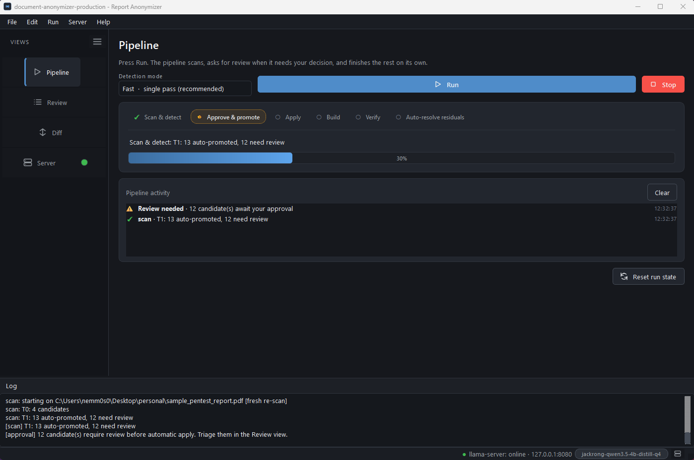
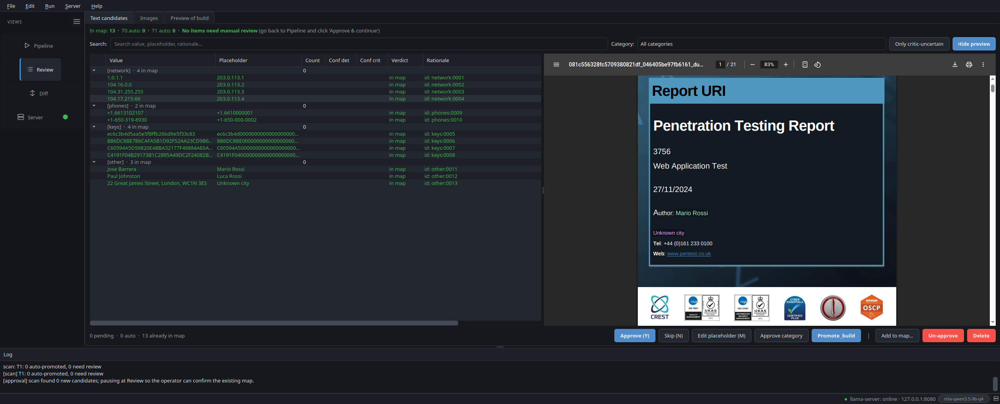
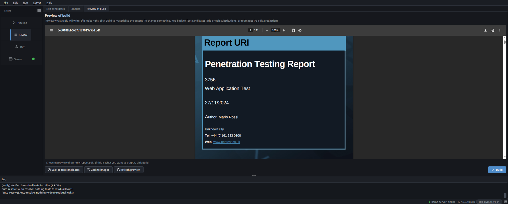
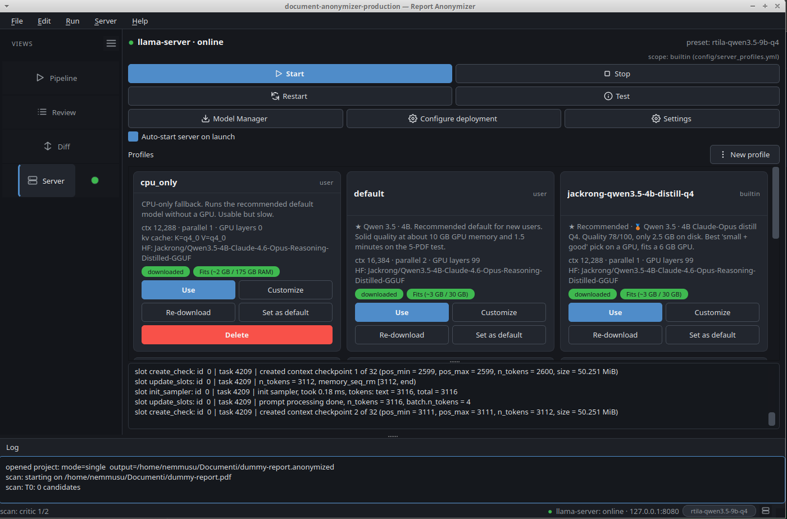
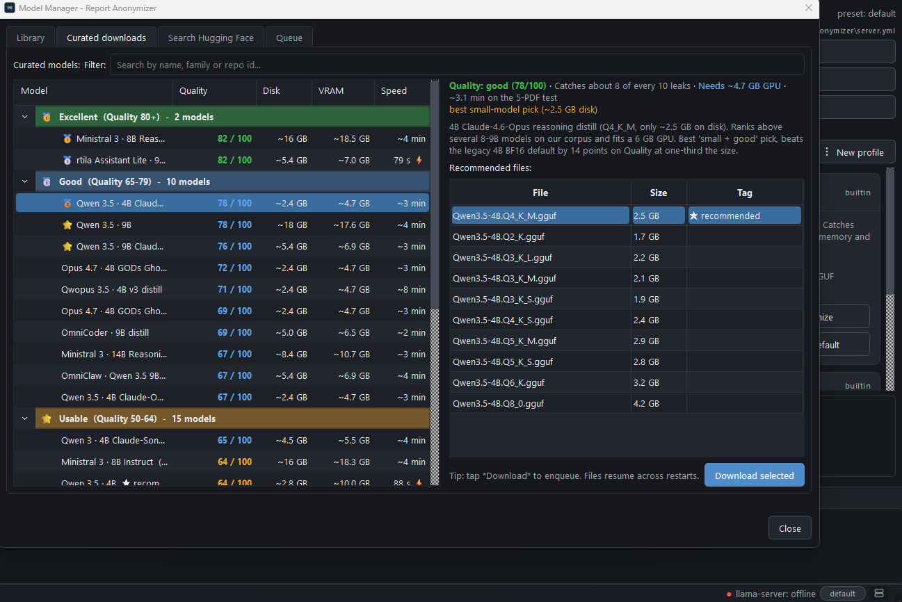

---
hide:
  - navigation
  - toc
---

# Report Anonymizer

<p class="hero-lead" markdown>
**Local LLM anonymizer for penetration-test reports.** Drop a folder
of PDFs, Office docs, Markdown or code: customer brand, real IPs,
phone numbers, hardcoded credentials, advisory IDs, AD SIDs, cloud
resource IDs and other identifying values are rewritten in place
with **plausible dummy values**. Exploit code, payloads and shell
output stay untouched. The pipeline talks to a local llama.cpp
server, so nothing leaves your machine, and the shipped default
preset runs comfortably on a regular laptop.
</p>

<p class="hero-cta" markdown>
[:octicons-download-24: &nbsp;Windows installer](https://github.com/nemmusu/report-anonymizer/releases/download/v1.0.0/Report-Anonymizer-Setup-x64-1.0.0.exe){ .md-button .md-button--primary }
[:octicons-download-24: &nbsp;AppImage](https://github.com/nemmusu/report-anonymizer/releases/download/v1.0.0/Report-Anonymizer-x86_64.AppImage){ .md-button .md-button--primary }
[:octicons-download-24: &nbsp;.deb](https://github.com/nemmusu/report-anonymizer/releases/download/v1.0.0/report-anonymizer_1.0.0_amd64.deb){ .md-button }
[:octicons-mark-github-16: &nbsp;View on GitHub](https://github.com/nemmusu/report-anonymizer){ .md-button }
[:octicons-star-16: &nbsp;Star on GitHub](https://github.com/nemmusu/report-anonymizer){ .md-button .md-button--star }
[:octicons-tag-16: &nbsp;Release notes](https://github.com/nemmusu/report-anonymizer/releases/tag/v1.0.0){ .md-button }
</p>

<p class="hero-meta" markdown>
:octicons-shield-check-16: GPL-3.0 &nbsp;·&nbsp;
:octicons-zap-16: 398 tests, 3 Python versions on CI &nbsp;·&nbsp;
:octicons-cpu-16: Runs locally on llama.cpp &nbsp;·&nbsp;
:octicons-package-16: Windows installer · AppImage · .deb · one-line installer
</p>

<figure markdown="span">
  { .hero-shot }
  <figcaption>Side-by-side native render. Every customer-identifying value is rewritten in place; layout, fonts and structure are preserved.</figcaption>
</figure>

---

## Why use it

<div class="grid cards" markdown>

-   :material-shield-lock:{ .lg .middle } __Local-only by design__

    ---

    No telemetry, no cloud LLMs, no analytics. The only network
    endpoint ever contacted is `huggingface.co`, and only when you
    explicitly download a model. Substitution maps stay in your
    project folder.

-   :material-eye-check:{ .lg .middle } __Operator-in-the-loop__

    ---

    The Review pane shows every candidate next to a **live render
    of the anonymized output**, not the original with overlay
    highlights. Approve, skip, edit or add custom words. What you
    see is what Apply will write.

-   :material-shape-outline:{ .lg .middle } __Layout-preserving__

    ---

    PDFs are redacted in place. Placeholders are length- and
    shape-preserving (ARN stays an ARN, hex stays hex, phone keeps
    its country code). Layout, fonts, even byte length stay close
    to the original.

-   :material-target:{ .lg .middle } __12 leak categories__

    ---

    Brand, network, phones, emails, credentials, keys, headers, app
    packages, user agents, internal IDs, infra IDs (AWS / Azure /
    GCP / AD SIDs), proprietary URI schemes. Exploit code, payloads
    and tool output are deliberately left intact.

-   :material-laptop:{ .lg .middle } __Runs on a regular laptop__

    ---

    The shipped `default` preset is CPU-only: a 4 B-parameter model,
    ~2.5 GB on disk, ~1.5 GB of RAM in use. **No GPU required.** If
    you have one (6 GB VRAM is enough), the wizard picks a faster
    GPU preset for you, but the entry point stays a regular laptop.

-   :material-image-edit-outline:{ .lg .middle } __Image redaction__

    ---

    Every embedded image (PDF / DOCX / PPTX) gets a thumbnail in
    the **Review &raquo; Images** tab. Open the editor, paint
    **blackout / blur / pixelate / text-overlay** rectangles with a
    colour picker for the text overlay. The canvas shows the
    actual baked pixels as you draw, not a translucent placeholder.
    Same image_id across pages = single decision, applied to every
    occurrence at the original xref / shape position.

-   :material-tune-variant:{ .lg .middle } __Detection mode picker__

    ---

    A combo box right next to **Run** on the Pipeline tab lets the
    operator switch between **Fast** (one monolithic prompt covers
    all 12 categories per chunk, ~30 s / typical PDF on the 4B
    preset) and **High accuracy** (11 focused per-category prompts
    are run against every chunk and the candidate lists are
    merged). On the local 5-PDF bench multi-pass lifted F1 from
    0.836 to 0.919, precision +0.12, recall +0.05, at the cost of
    roughly 5x more detector time. Same toggle from the CLI via
    `--detector-mode single | multipass`.

</div>

---

## Get it

Four install paths. Same code in all of them; they differ only in
how the runtime is brought to your disk.

<div class="grid cards" markdown>

-   :material-microsoft-windows:{ .lg .middle } __Windows installer__ &nbsp;:material-star-circle:{ .star-recommended title="Windows users" }

    ---

    Native `Setup.exe` for Windows 10 / 11. Bundles the embedded
    Python runtime, `llama-server.exe` (CPU / CUDA / Vulkan
    variants), `pandoc`, `pdftotext` and everything else. Pick the
    backend that matches your GPU at install time. Per-user install
    (no admin), one desktop shortcut, one Start-menu entry.

    [:octicons-download-16: &nbsp;Download Setup.exe &nbsp;·&nbsp; 338 MB](https://github.com/nemmusu/report-anonymizer/releases/download/v1.0.0/Report-Anonymizer-Setup-x64-1.0.0.exe){ .md-button .md-button--primary }
    [:octicons-book-16: &nbsp;Install guide](install-windows.md){ .md-button }

-   :material-application-outline:{ .lg .middle } __AppImage__ &nbsp;:material-star-circle:{ .star-recommended title="Linux users" }

    ---

    Single self-contained binary. **No install, no root, no system
    Python.** Bundles a portable interpreter, every Python
    dependency (PySide6, WeasyPrint), `pandoc` and `pdftotext`. Just
    `chmod +x` and run.

    [:octicons-download-16: &nbsp;Download AppImage &nbsp;·&nbsp; 410 MB](https://github.com/nemmusu/report-anonymizer/releases/download/v1.0.0/Report-Anonymizer-x86_64.AppImage){ .md-button .md-button--primary }

-   :material-debian:{ .lg .middle } __.deb__ (Debian / Ubuntu / Mint)

    ---

    Smaller download (240 KB). Runtime Python deps are pulled from
    PyPI by the `postinstall` hook. Integrates with `apt`,
    registers a desktop entry, adds `report-anonymizer` to your
    `$PATH`. Requires root to install.

    [:octicons-download-16: &nbsp;Download .deb &nbsp;·&nbsp; 240 KB](https://github.com/nemmusu/report-anonymizer/releases/download/v1.0.0/report-anonymizer_1.0.0_amd64.deb){ .md-button .md-button--primary }

-   :material-console-line:{ .lg .middle } __One-line installer__ (Linux / macOS)

    ---

    Per-user install under `~/.local/share/report-anonymizer`,
    launcher in `~/.local/bin/`. Detects missing system tools
    (pandoc, poppler-utils, Pango) and offers to install them via
    `apt-get`, `dnf`, `pacman`, `zypper` or `brew`. No root needed.

    [:octicons-mark-github-16: &nbsp;View install.sh on GitHub](https://github.com/nemmusu/report-anonymizer/blob/master/install.sh){ .md-button }

</div>

=== "Windows"

    Double-click `Report-Anonymizer-Setup-x64-1.0.0.exe`. The
    Setup wizard detects your GPU, recommends the matching
    llama.cpp variant (CUDA / Vulkan / CPU) and bundles it together
    with the embedded Python runtime. A desktop and Start-menu
    entry are created; uninstall is registered with the OS.
    See the [Windows install guide](install-windows.md) for the
    full walkthrough + screenshots.

=== "AppImage"

    ```bash
    chmod +x Report-Anonymizer-x86_64.AppImage
    ./Report-Anonymizer-x86_64.AppImage              # GUI
    ./Report-Anonymizer-x86_64.AppImage cli all in/ -o out/
    ```

=== ".deb"

    ```bash
    sudo apt install ./report-anonymizer_1.0.0_amd64.deb
    report-anonymizer
    ```

=== "install.sh"

    ```bash
    curl -fsSL https://raw.githubusercontent.com/nemmusu/report-anonymizer/master/install.sh | bash
    ```

!!! tip "AppImage doesn't open?"

    If you double-click the AppImage and nothing happens, your
    distro probably needs `libfuse2` for AppImage's mount layer:
    `sudo apt install libfuse2` (Debian / Ubuntu / Mint),
    `sudo dnf install fuse-libs` (Fedora / RHEL),
    `sudo pacman -S fuse2` (Arch / Manjaro).

---

## A 60-second tour

=== "Pipeline"

    <figure markdown="span">
      
      <figcaption>Single-click pipeline. Pauses at <em>Approve &amp; promote</em> when the operator must decide; resumes through Apply / Build / Verify / Auto-resolve on its own.</figcaption>
    </figure>

=== "Review"

    <figure markdown="span">
      
      <figcaption>Unified Review tree. The right pane is a <em>live render of the anonymized output</em>, not the original with overlay highlights.</figcaption>
    </figure>

=== "Images"

    <figure markdown="span">
      
      <figcaption>Per-image editor with 4 tools. The canvas shows real baked pixels (not placeholder rectangles), so what you see is what Apply will write.</figcaption>
    </figure>

=== "Build preview"

    <figure markdown="span">
      
      <figcaption>Final confirmation gate before Apply. PDF.js viewer with native text selection and a one-click route back to text or image edits if something looks off.</figcaption>
    </figure>

=== "Server"

    <figure markdown="span">
      
      <figcaption>Preset gallery with Quality / Disk / VRAM-fit per card, command preview, one-click start/stop.</figcaption>
    </figure>

=== "Models"

    <figure markdown="span">
      
      <figcaption>Curated GGUF catalog with Quality / VRAM / time-on-bench badges; resumable streaming downloads with a Queue tab.</figcaption>
    </figure>

---

## Documentation

<div class="grid cards" markdown>

-   :material-format-list-bulleted-type:{ .lg .middle } [__What it anonymizes__](anonymization-scope.md)

    ---

    The 12 leak categories the detector emits, with examples of the
    placeholders it produces and the (long) list of strings it
    deliberately leaves alone so the report's technical content
    keeps working.

-   :material-chart-bar:{ .lg .middle } [__Benchmarks__](benchmarks.md)

    ---

    Quality score, precision, recall and VRAM for the curated 5
    presets. Plus the 24 below-cut models and the 4 architecturally
    incompatible ones, with root-cause notes.

-   :material-graph-outline:{ .lg .middle } [__Architecture__](architecture.md)

    ---

    Pipeline data flow, on-disk schema (manifests, substitution
    maps, applied substitutions, decisions log) and the per-stage
    cancellation contract.

-   :material-server:{ .lg .middle } [__Presets__](presets.md)

    ---

    The shipped server profiles, how to pick one for your hardware,
    and how to customise a preset (per-user or per-project scope).

-   :material-help-circle:{ .lg .middle } [__FAQ__](faq.md)

    ---

    Common questions: diff cache, OCR scope, offline-mode
    behaviour, format adapters, HIPAA / GDPR scope.

-   :material-microsoft-windows:{ .lg .middle } [__Windows install__](install-windows.md)

    ---

    Step-by-step walkthrough of the `Setup.exe` wizard: variant
    pick (CPU / CUDA / Vulkan), where files land, uninstall flow,
    keep-user-data prompt.

-   :material-source-pull:{ .lg .middle } [__Contributing__](contributing.md)

    ---

    Development setup, code style, what we look for in a PR, how
    to add a format adapter.

</div>

---

<p class="hero-meta" markdown>
[:octicons-mark-github-16: Source on GitHub](https://github.com/nemmusu/report-anonymizer) &nbsp;·&nbsp;
[:octicons-tag-16: Releases](https://github.com/nemmusu/report-anonymizer/releases) &nbsp;·&nbsp;
[:octicons-issue-opened-16: Open an issue](https://github.com/nemmusu/report-anonymizer/issues/new) &nbsp;·&nbsp;
[:octicons-law-16: GPL-3.0](https://github.com/nemmusu/report-anonymizer/blob/master/LICENSE)
</p>
