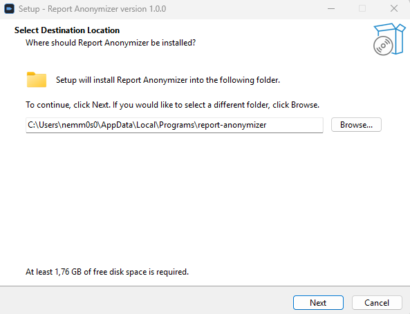

# Windows install

Native Windows installer for Report Anonymizer. Bundles the embedded
Python runtime, `llama-server.exe` (CPU / CUDA / Vulkan variants),
`pandoc`, `pdftotext` and everything else needed to run the pipeline
offline. Tested on Windows 10 (1809+) and Windows 11.

## Download

[:octicons-download-24: &nbsp;Report-Anonymizer-Setup-x64-1.0.0.exe &nbsp;·&nbsp; 338 MB](https://github.com/nemmusu/report-anonymizer/releases/download/v1.0.0/Report-Anonymizer-Setup-x64-1.0.0.exe){ .md-button .md-button--primary }

The installer is **unsigned** today (no Authenticode certificate);
SmartScreen may flag it on first run with a "Windows protected your
PC" dialog. Click **More info → Run anyway** to proceed. The
SHA256 of every release is published in the GitHub Release page so
the file can be verified out-of-band.

## What the wizard does

The Setup wizard runs entirely without admin rights and writes
everything under your user profile:

| Path | Content |
|---|---|
| `%LOCALAPPDATA%\Programs\report-anonymizer\` | Install root: embedded Python, `llama-server.exe`, `pandoc`, `pdftotext`, GUI launcher |
| `%APPDATA%\report-anonymizer\` | Server preset (`server.yml`), preferences (`app_settings.yml`), Hugging Face token, installer sentinel |
| `%LOCALAPPDATA%\report-anonymizer\` | Downloaded GGUF models, transient cache |

### 1 — Pick the llama.cpp variant

<figure markdown="span">
  
  <figcaption>Hardware detection runs <code>nvidia-smi</code>, then PowerShell <code>Get-CimInstance</code>, then legacy <code>wmic</code>. The recommended radio is preselected; you can override by clicking another row.</figcaption>
</figure>

Three real variants ship in the EXE:

- **CPU (AVX2, ~10 MB)** — universal fallback. Works on any x86-64 CPU,
  no GPU needed. Slower for the 4 B-parameter baseline (~30 s on the
  5-PDF test) but plenty fast for occasional runs.
- **CUDA 12.x (~150 MB)** — NVIDIA GPUs with driver ≥ 535 (CUDA 12.0).
  Best throughput on the 4 B preset (4-5× faster than CPU).
- **Vulkan (~30 MB)** — NVIDIA / AMD / Intel via the Vulkan runtime.
  Pick this on AMD / Intel iGPU or when CUDA isn't available.

Two extra radios:

- **Skip** — install Report Anonymizer without any llama-server. The
  GUI's *Configure deployment* page lets you point at an external
  server later (BYOS mode).
- **Keep existing** — appears when the installer detects a previous
  install of one of the three variants. Preserves whatever variant
  was already on disk; the recommended variant is still pre-selected
  if it differs from the existing one.

### 2 — Install to default location

<figure markdown="span">
  
  <figcaption>Per-user install. No admin prompt, no privilege escalation.</figcaption>
</figure>

The default path is `%LOCALAPPDATA%\Programs\report-anonymizer\`,
which doesn't need admin rights. You can override it but the GUI
still expects the supporting folders under `%APPDATA%` and
`%LOCALAPPDATA%`.

### 3 — First launch

After the wizard finishes, Report Anonymizer opens automatically.
Then:

- The **first-run wizard** detects the bundled `llama-server.exe`
  via the installer sentinel (`%APPDATA%\report-anonymizer\.installer_choice.json`),
  skips the "install llama-server" step entirely and lets you
  pick a preset + download the GGUF model in one click.
- The **Server panel → Configure deployment** dialog now exposes
  a **Backend** dropdown (CPU / CUDA / Vulkan) on Windows, so you
  can switch backend after the install without re-running Setup.
- The GUI lives in `%APPDATA%\report-anonymizer\` (config) and
  `%LOCALAPPDATA%\report-anonymizer\` (downloaded models and cache).

## Uninstall

Use *Settings → Apps → Installed apps → Report Anonymizer →
Uninstall*. The uninstaller asks one question:

> **Remove user data too?**
>
> - **Yes** — also delete settings and downloaded models
>   (`%APPDATA%\report-anonymizer` + `%LOCALAPPDATA%\report-anonymizer`).
> - **No** *(default)* — keep them so a future reinstall can reuse
>   the models without re-downloading. The install folder is removed
>   regardless of this choice.

Silent uninstall (`/VERYSILENT`) defaults to **No** (keep user
data), matching the conservative behaviour of every other Windows
uninstaller.

## Build from source

The installer is produced by `packaging/windows/build.ps1`. On a
Windows 11 dev box with PowerShell 5.1 / 7.x:

```powershell
cd packaging\windows
.\build.ps1                       # full build, ~18 min cold
.\build.ps1 -SkipBootstrap        # ~5 min when the tooling cache exists
.\build.ps1 -Clean                # cold rebuild from scratch
.\build.ps1 -Lean                 # CPU-only build, ~225 MB EXE
```

The script bootstraps `7zr.exe`, Inno Setup 6 and MinGW UCRT into
`packaging\windows\build-cache\tools\`, downloads the Python embed
ZIP, the WeasyPrint Windows bundle, poppler-windows and the three
llama.cpp variant ZIPs, assembles the staging tree under
`packaging\windows\staging\app\`, then runs ISCC to produce
`packaging\windows\dist\Report-Anonymizer-Setup-x64-<version>.exe`.

Use `pwsh -ExecutionPolicy Bypass -File .\build.ps1` if PowerShell
refuses to run the script under a restricted Execution Policy.
